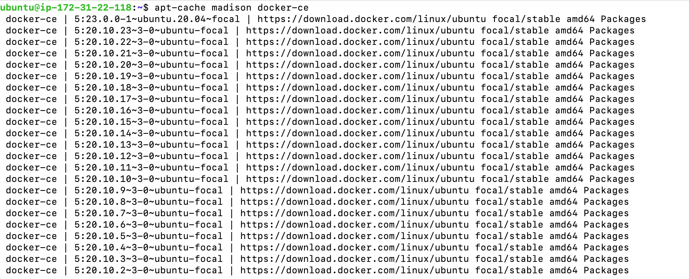
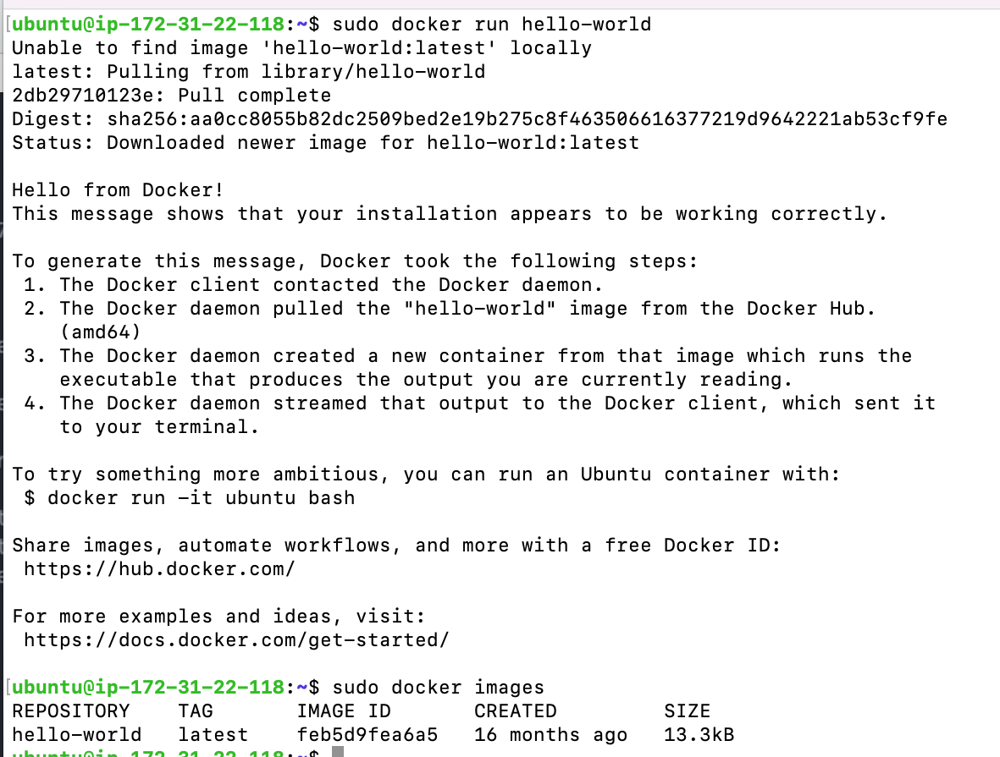
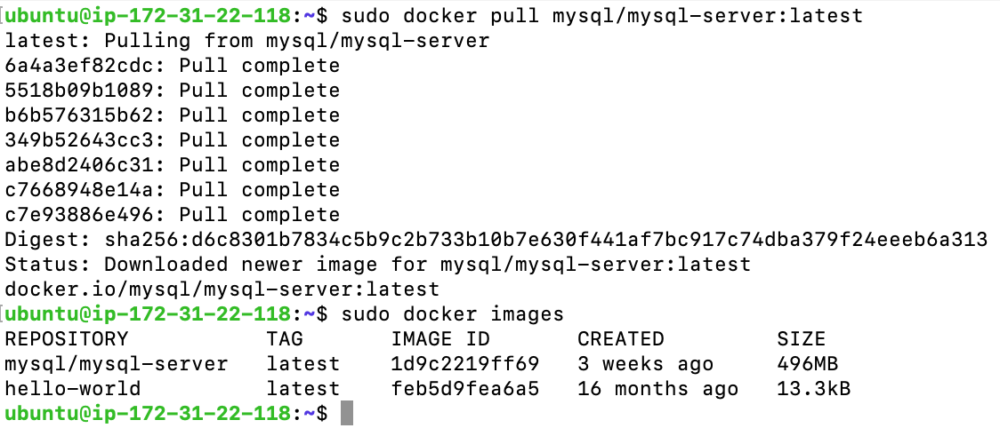
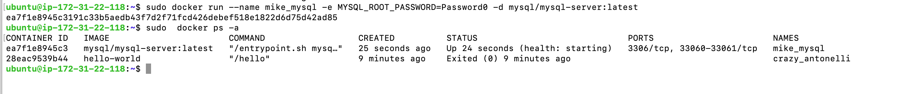
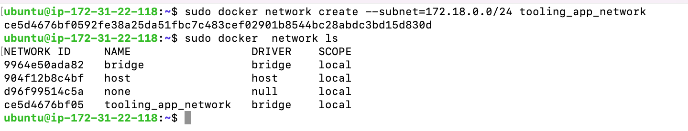
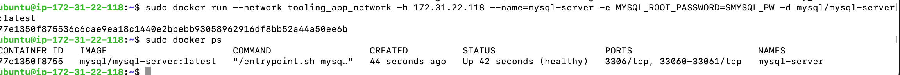
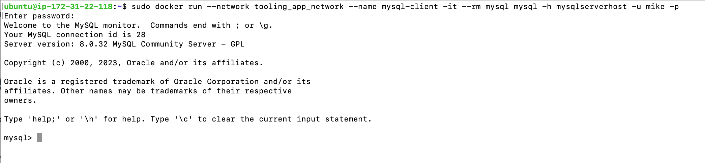
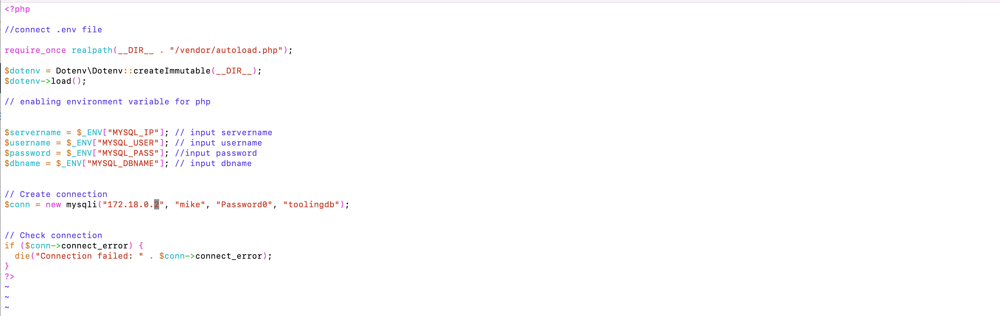
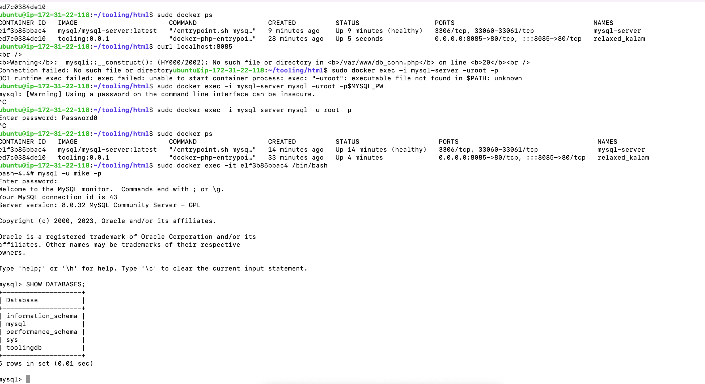
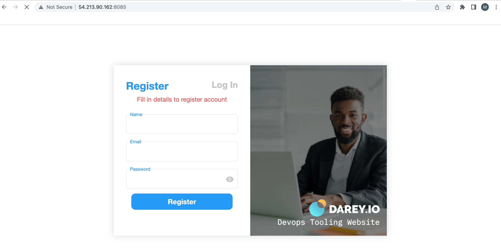

MIGRATION TO THE СLOUD WITH CONTAINERIZATION. PART 1 – DOCKER &AMP; DOCKER COMPOSE

Docker is a software platform that allows you to build, test, and deploy applications quickly. Docker packages software into standardized units called containers that have everything the software needs to run including libraries, system tools, code, and runtime. Using Docker, you can quickly deploy and scale applications into any environment and know your code will run. The software that hosts the containers is called Docker Engine.

### Docker Installation

First, we need to install Docker Engine, which is a client-server application that contains:

- A server with a long-running daemon process dockerd.
- APIs that specify interfaces that programs can use to talk to and instruct the Docker daemon.
- A command-line interface (CLI) client docker.

####  Installing docker on an Ubuntu instance

```
sudo apt-get update
```
```
sudo apt-get install ca-certificates curl gnupg lsb-release
```
- Add Docker’s official GPG key
```
sudo mkdir -m 0755 -p /etc/apt/keyrings
```

```
curl -fsSL https://download.docker.com/linux/ubuntu/gpg | sudo gpg --dearmor -o /usr/share/keyrings/docker-archive-keyring.gpg
```
- Then the command below was used to set up the stabel repository

```
 echo \
  "deb [arch=$(dpkg --print-architecture) signed-by=/etc/apt/keyrings/docker.gpg] https://download.docker.com/linux/ubuntu \
  $(lsb_release -cs) stable" | sudo tee /etc/apt/sources.list.d/docker.list > /dev/null
```

- Installed Docker Engine

```
 sudo apt-get update
```

```
sudo apt-get install docker-ce docker-ce-cli containerd.io
```

- Install specific version of docker

```
apt-cache madison docker-ce
```


```
sudo apt-get install docker-ce=5:20.10.23~3-0~ubuntu-focal docker-ce=5:20.10.23~3-0~ubuntu-focal containerd.io
```
- Verified that the Docker Engine installation is successful by running the hello-world image:

 ```
 sudo docker run hello-world
 ```


A tooling web application will be used same from previous projects done, its a PHP-based web solution backed by a MYSQL database.

Hence, Migration of the Tooling web Application from VM-based solution into a containerized one.

### Pull MySQL Docker Image from Docker Hub Registry

- pulled the latest version of mysql from docker hub registry.

```
sudo docker pull mysql/mysql-server:latest
```


### Deploy the MySQL Container to your Docker Engine

```
sudo  docker run -d --name mike-mysql-server -e MYSQL_ROOT_PASSWORD=password mysql/mysql-server:latest
```

- checked if the MYSQL container is running with 

```
docker ps -a
```



### Connecting to the MySQL Docker Container

We can either connect directly to the container running the MySQL server or use a second container as a MySQL client. In this case a second container was used as a MySQL client.

First, created a network: 

```
docker network create --subnet=172.18.0.0/24 tooling_app_network
```

Creating a custom network is not necessary because even if we do not create a network, Docker will use the default network for all the containers you run. By default, the network we created above is of DRIVER Bridge. So, also, it is the default network. The network created can be seen below



Creating a network with a subnet dedicated for this project and use it for both MYSQL and the application so that they can connect.

- Created an environment variable to store the root password: 
```
export MYSQL_PW=password
```

- Then, pulled the image and run the container, all in one command:

```
docker run --network tooling_app_network -h 172.31.22.118 --name=mysql-server -e MYSQL_ROOT_PASSWORD=$MYSQL_PW -d mysql/mysql-server:latest
```



- Created a SQL Script that will create a user that can be used to connect remotely.

- Created a file and named it create_user.sql which was populated with the code below

```
CREATE USER 'mike'@'%' IDENTIFIED BY 'Password0'; GRANT ALL PRIVILEGES ON * . * TO 'mike'@'%';
```


- Run the script 

```
docker exec -i mysql-server mysql -uroot -p$MYSQL_PW < ./create_user.sql
```

### Connecting to the MySQL server from a second container running the MySQL client utility

```
docker run --network tooling_app_network --name mysql-client -it --rm mysql mysql -h mysqlserverhost -u mike -p
```



###  Prepare database schema

A database schema needs to be prepared so the Tooling application can connect to it.

- cloned the Tooling-app repositopry from 

```
git clone https://github.com/darey-devops/tooling.git
```

- from my terminal exported the location of the SQL file using
```
export tooling_db_schema=/home/ubuntu/tooling/html/tooling_db_schema.sql
```

- Used the SQL script to create the database and prepare the schema. With the docker exec command, execute a command in a running container. 

```
docker exec -i mysql-server mysql -uroot -p$MYSQL_PW < $tooling_db_schema 
```

- Edit the .env file in the tooling/html folder with your db credentials used in your create_user.sql

- edited the db_conn.php file 





- from the tooling folder run 
```
docker build -t tooling:0.0.1 .
```

- Run the container: 
```
docker run --network tooling_app_network -p 8085:80 -it tooling:0.0.1
```



